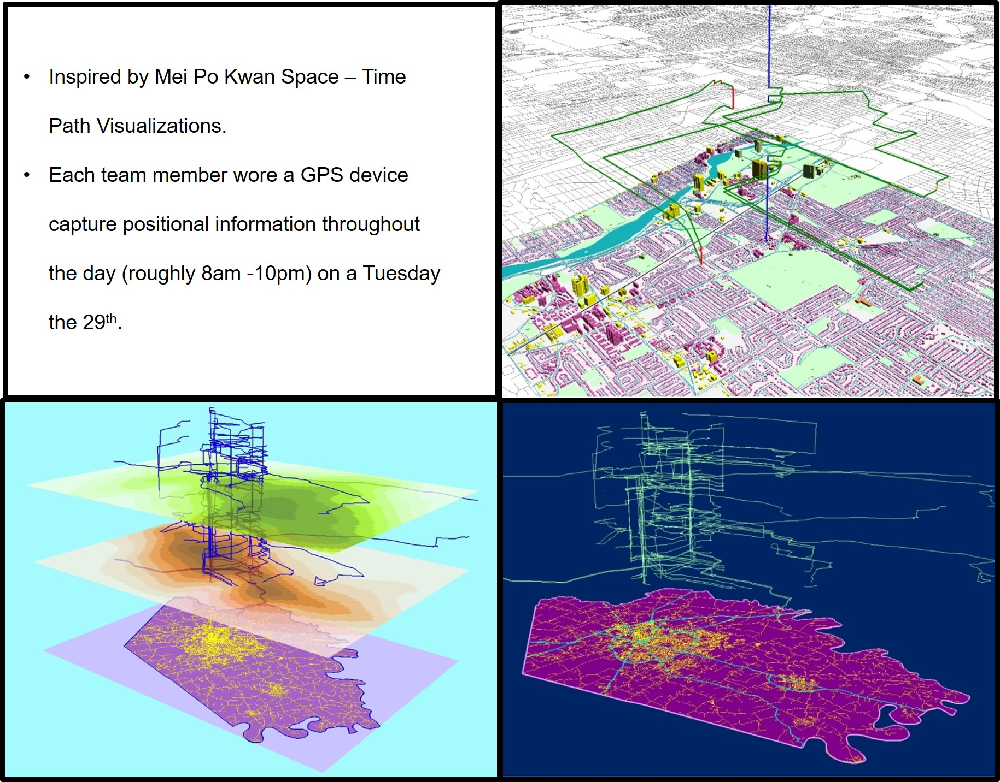
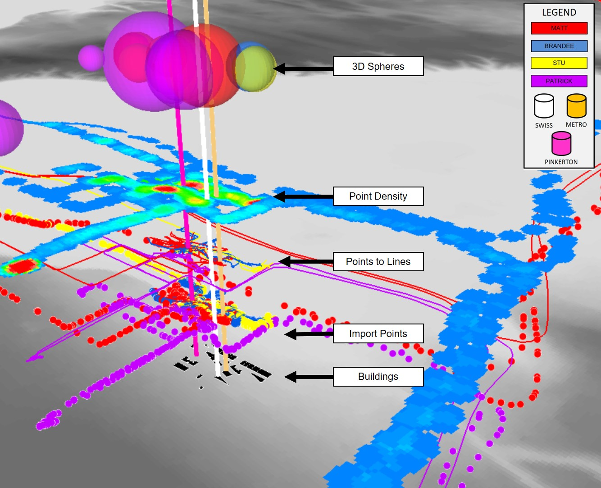
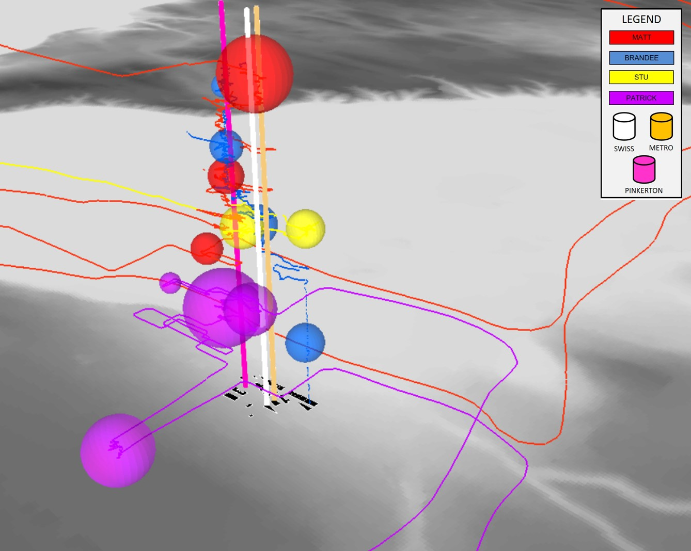

# SpaceTimePathVisualization
Introduction to a Space-Time Path Visualization.
## Basics

## Structured Layers

a. This first option errored out when I ran the application. My assumption is that it is because it is calling a Map Service I created a hosted on a secure platform. I tried to 'Add Item' to my ArcGIS Online and embed security credentials but it was still erroring out. (<a href="https://youtu.be/F-1FVWIzzqo">YouTube Video</a>)

## Results

a. This first option errored out when I ran the application. My assumption is that it is because it is calling a Map Service I created a hosted on a secure platform. I tried to 'Add Item' to my ArcGIS Online and embed security credentials but it was still erroring out. (<a href="https://youtu.be/BXLYv3krnqs" target="_blank">Results - YouTube Video</a>)

## Acknowledgments

* Mei Po Kwan work (<a href="https://youtu.be/F-1FVWIzzqo">YouTube Video</a>)
