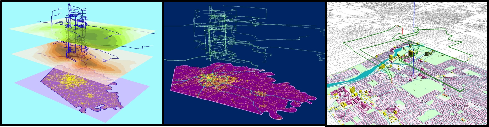

# Space-Time Path Visualization (Time Map)
Providing some information and graphics pertaining to the creation of 3D Space-Time Path Visualizations of GPS data collected for a day. 

## Basics


```
Similiarities:
- Each team carried an active GPS and logged data during the course of a day.
- Sequentially increased elevation of points and lines.

Differences:
- Created spheres of activity where the size of the sphere indicates a greater amount of time spent at a location. 
- Displayed time and activity in relation to environmental risk factors.
```


## Structured Layers


This image deconstructs the geospatial information proivded in this interpretation of a 3D Space-Time Path Visualization: UWT buildings, GPS point data, polylines generated from GPS points, point density rasters, and 3D time-spheres. Additionally, this graphic provides a simplified workflow for the creation of the map. Click here for a video demonstration (<a href="https://youtu.be/F-1FVWIzzqo">Structured Layers - YouTube Video</a>).

## Results


Here, the data is combined. Generally, the vertical increase in the features is representative of time of day: the lower to the ground, the earlier in the day it is. Collection occurred on the June 29th, 2018, roughly between the time of 8am - 10pm. Click here for a video demonstration (<a href="https://youtu.be/BXLYv3krnqs" target="_blank">Results - YouTube Video</a>).

## Acknowledgments and Tech Used

* <a href="http://meipokwan.org/Gallery/STPaths.htm"> Mei Po Kwan's work. </a>
* 3D GIS - ESRI ArcScene v10.6
* Processing GIS - ESRI Desktop v10.6
